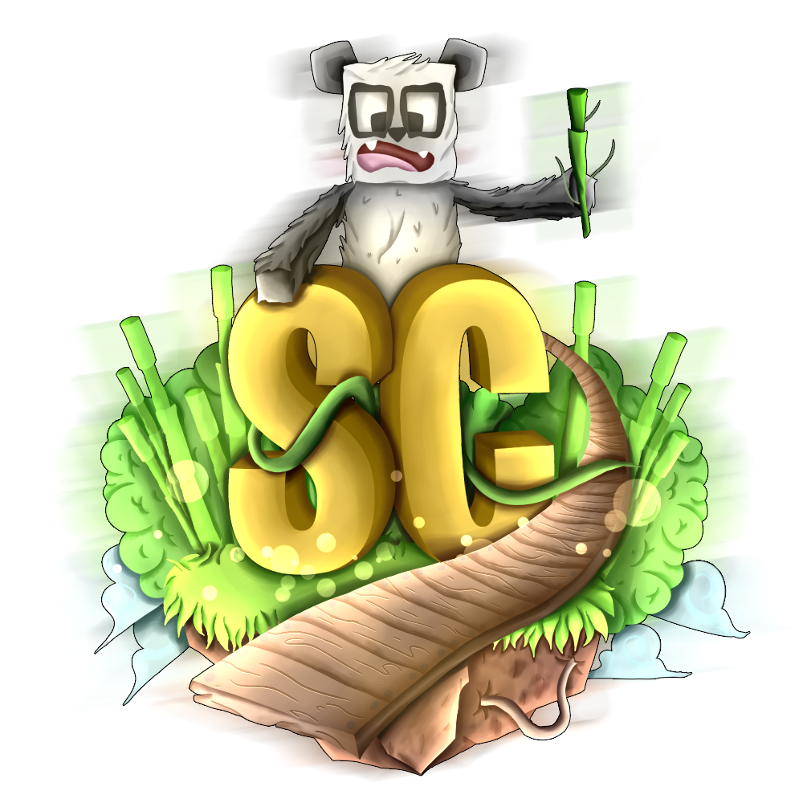

<br/>
<p align="center">
  <a href="https://scbots.gitbook.io/surviecraft/" target="_blank">
    
  </a>

  <h1 align="center">SurvieCraft Bot V2</h1>

  <p align="center">
    SurvieCraft Bot est un bot Discord multifonctions privé appartenant au serveur Minecraft SurvieCraft
   </p>
</p>

## Table Of Contents

- [Installation](#installation)
- [Authors](#authors)
- [License](#license)

## Installation

```bash
  git clone https://github.com/Simon-Fontaine/surviecraft-v2.git
  cd codecracker
  
  npm i
```

## Authors

- [@Simon-Fontaine](https://github.com/Simon-Fontaine)

## License

[MIT](https://choosealicense.com/licenses/mit/)
